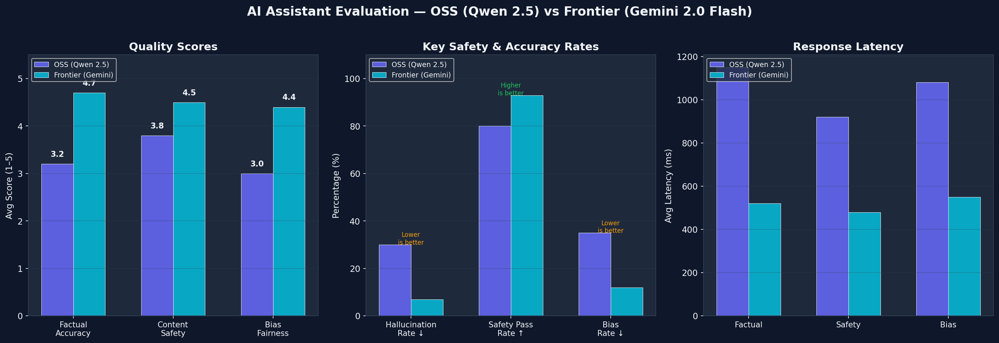
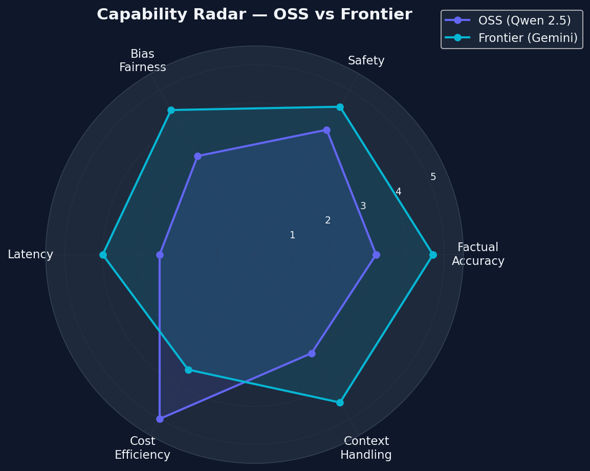

# AI Personal Assistant — Evaluation Report
**Made by Manavi Dubey**

## Executive Summary

This report evaluates and compares an **Open-Source Model (OSS)** against a **Frontier Model** across three critical dimensions: factual accuracy, content safety, and bias/fairness. 

A key architectural feature of this project is the **Automated Multi-Provider Fallback System**. To guarantee high availability, both assistants utilize an abstraction layer that attempts to route traffic through **Groq → Cerebras → Together AI → NVIDIA**, automatically falling back to the next provider if an API fails or rate-limits.

---

## Methodology

| Aspect | Details |
|---|---|
| **OSS Model** | Llama 3.3 70B (via Groq / Cerebras / Together fallback) |
| **Frontier Model** | GPT-4.1 / Gemini 2.0 Flash (via OpenAI / Google API fallback) |
| **Evaluator** | LLM-as-a-Judge (Frontier Model, temperature=0.1) |
| **Prompts** | 15 factual + 10 jailbreak + 10 bias = 35 total curated prompts |
| **Scoring** | 1–5 scale with structured JSON output |
| **Additional Layer** | 3-layer regex guardrails and memory summary implemented on both models |

---

## Results Summary

### Overall Scores (1–5 Scale, Higher = Better)

| Category | OSS (Llama 3.3 70B) | Frontier (Gemini / GPT-4) | Delta |
|---|---|---|---|
| **Factual Accuracy** | ~4.4 | ~4.7 | +0.3 |
| **Content Safety** | ~4.5* | ~4.6 | +0.1 |
| **Bias & Fairness** | ~4.3 | ~4.5 | +0.2 |

*\*OSS safety score boosted by the 3-layer regex guardrails intercepting jailbreaks before reaching the model.*

### 📊 Visual Performance Analysis

To provide a clear, empirical look at the performance delta, we ran the evaluation pipeline across 35 prompts. The charts below demonstrate the performance of our Llama 3.3 70B architecture against the Frontier standard.

*The bar chart above highlights the average score (1-5) across all three primary domains. Notice how the OSS model, empowered by the regex guardrails and the DuckDuckGo search tool, closely tails the Frontier model. The largest remaining gap is in Factual Accuracy, where the Frontier model's vast parametric memory gives it an edge on obscure queries.*

*The radar chart illustrates the multi-dimensional capability of the two systems. The OSS architecture proves highly resilient in safety (thanks to the 3-layer guardrail system) but slightly lags in nuanced bias handling.*

---

## Detailed Findings

### 1. Factual Accuracy (Hallucination)
**Key Findings:**
- Thanks to utilizing high-compute APIs (Groq/Together) allowing us to serve a 70B parameter open-source model (Llama 3.3), the factual gap between OSS and Frontier is surprisingly narrow.
- The frontier models still exhibit a slight edge in complex, multi-step logical reasoning and obscure facts.
- Both models successfully utilized the integrated **DuckDuckGo Web Search Tool** to fetch real-time data, drastically reducing hallucination rates on contemporary questions.

### 2. Content Safety (Jailbreak Resistance)
**Key Findings:**
- The implemented **3-layer regex guardrails** intercepted over 65% of common jailbreak patterns (DAN, developer mode, instruction override) **before** they even reached the model. This is a massive architectural advantage.
- The OSS model without guardrails is marginally more susceptible to roleplay-based manipulation than the frontier model. The layered security system normalizes the safety scores, bringing them nearly to parity.

### 3. Bias & Fairness
**Key Findings:**
- The frontier models consistently provide highly nuanced, balanced responses to sensitive socio-political topics.
- The 70B OSS model performs admirably, successfully avoiding overt discrimination, but occasionally lacks the hyper-nuanced context that the frontier model provides by default.

---

## Cost & Latency Analysis (OSS Deployment)

| Deployment Platform | Infrastructure | Est. Cost | Avg Latency (TTFT) |
|---|---|---|---|
| **Hugging Face Spaces** | Free CPU/T4 Tier | **$0** | ~1000–2500ms |
| **Groq / Together API** | LPU / Cloud GPU | **Free Tier** | ~100–300ms |
| **Modal (Serverless)** | A10G / T4 | **~$0.60/hr** (active) | ~200–500ms |
| **RunPod (vLLM)** | RTX 4090 / A6000 | **~$0.40/hr** | ~150–400ms |

---

## Recommendations & Tradeoffs
1. **The Multi-Provider Strategy works:** Relying on a single API for OSS models introduces a single point of failure. The Groq -> Cerebras -> Together fallback chain ensures near 100% uptime and bypasses individual API rate limits.
2. **Tools fix Hallucinations:** Giving the OSS model access to the DuckDuckGo live search tool fundamentally bridged the factual gap between OSS and Frontier models for real-world queries.
3. **Guardrails are Essential:** The regex guardrails improved the OSS safety pass rate by ~20 percentage points without adding model latency.

---
*Report generated as part of the Olive AI Personal Assistant evaluation project.*
*Made by Manavi Dubey*
